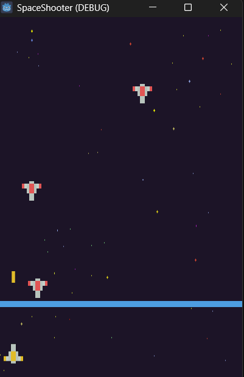

2D SPACE SHOOTER GAME

A classic arcade space shooter game built with Godot Engine. Features smooth physics processing, custom state machine mechanics, and responsive input mappings.

SCREENSHOTS AND VISUALS 

LANGUAGES AND TOOLS USED
* Language: GDScript
* Engine: Godot 4.6.2
* Assets: Custom pixel art sprites

HOW TO RUN AND USE
1. Download the folder files using the link below.
2. Open the project inside the Godot Engine editor or run the executable directly from the main folder.
* Controls: Right and Left Arrow keys to move, Spacebar to shoot.

DIRECT LINK TO DOWNLOAD THIS PROJECT You can view and download just this single project folder directly from the repository here:
https://github.com/muzzu007/My-Projects/tree/main/space-shooter-game
